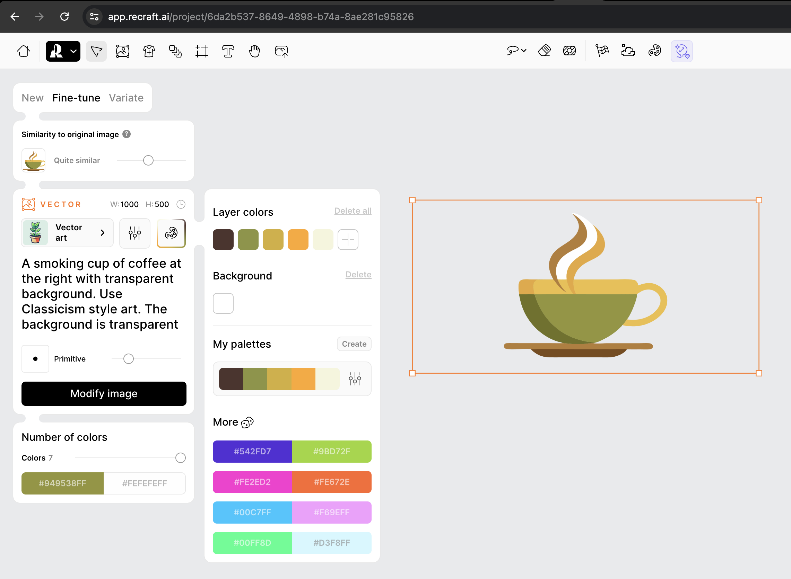

### Diseño del producto

[Documento de Google Docs](https://docs.google.com/document/d/12fgML_QP_jFvY_g_vQuKUnx9c-Kvpeq-79XROsStII0/edit) con los prompts usados para generar el concepto del producto y obtener guias para generar las secciones del sitio.


# Generacion de secciones especificas del sitio

## Titulo y descripcion del sitio jekyll

Prompt:

    Eres un experto en branding y en diseño de sitios web. Me ayudaras a crear el contenido para el sitio web de la marca de cafe mexicano "Amanecer Veracruzano". El slogan de la marca es "Despierta Tus Sentidos".

    Genera el titulo y la descripcion que deberan ser incluidas en el _config.yaml

Respuesta de Gemini:

    Título y descripción para el archivo _config.yaml de Amanecer Veracruzano
    Título: Amanecer Veracruzano: Despierta Tus Sentidos

    Descripción: Café mexicano de alta calidad, cultivado con pasión y tradición. Disfruta del sabor auténtico de Veracruz y apoya a caficultores locales.

    Explicación:

    Título: El título debe ser claro, conciso y atractivo, y debe incluir el nombre de la marca y el slogan.
    Descripción: La descripción debe ser informativa y atractiva, y debe destacar los beneficios de comprar café Amanecer Veracruzano. Debe incluir palabras clave relevantes para el SEO.
    Consideraciones adicionales:

    Puedes ajustar el título y la descripción en función del tema de Jekyll que estés utilizando.
    Es importante que el título y la descripción sean únicos para tu sitio web, y que no se copien de otros sitios.
    Puedes utilizar herramientas como SEOMetter [se quitó una URL no válida] para analizar el título y la descripción y asegurarte de que estén optimizados para los motores de búsqueda.
    Ejemplo de código YAML:

    ```
    title: Amanecer Veracruzano: Despierta Tus Sentidos
    description: Café mexicano de alta calidad, cultivado con pasión y tradición. Disfruta del sabor auténtico de Veracruz y apoya a caficultores locales.
    ```

### Generacion de productos en formato yaml

El tema escogido del sitio jekyll permite hacer un listado de productos en formato yaml para luego generar el contenido en HTML.
Se le pide a Gemini que genere tres productos ficticios de cafe de grano.

Prompt:

    Genera tres productos ficticios de cafe de grano en el formato yaml que te proporciono a continuacion. Debes generar el titulo, el subtitulo, la descripcion, el codigo del producto y al menos tres caracteristicas sobresaliente de esta cosecha o de esta especie de cafe. Se creativo por favor. Tambien selecciona un icono de Font-awesome que este acorde a la caracteristica sobresaliente que se esta mencionando. Solo quiero codigo yaml. No texto plano.


```yaml
title: Nombre del producto
subtitle: Genera un subtitulo adecuado para este cafe
description: Genera una descripcion de 2 parrafos con las caracteristicas mas sobresalientes de esta cosecha
hero_image: /img/hero-img.jpg
product_code: ABC124
layout: product
image: https://via.placeholder.com/640x480
price: $100.00 mxn + gastos de envio
features:
    - label: Caracteristica sobresaliente 1
      icon: fa-location-arrow
    - label: Caracteristica sobresaliente 2
      icon: fa-grin-stars
    - label: Caracteristica sobresaliente 1
      icon: fa-fighter-jet
rating: 3
```

Respuesta de Gemini:

> Productos ficticios de café de grano en formato YAML.  Producto 1: Amanecer Esmeralda

```yaml
title: Amanecer Esmeralda: Joya Verde de Veracruz
subtitle: Un café excepcional de altura, de sabor suave y aroma floral.
description: |
    Disfrute de una experiencia cafetera única con Amanecer Esmeralda, un café cultivado en las altas montañas de Veracruz, donde el clima fresco y la neblina constante crean las condiciones perfectas para el desarrollo de granos excepcionales. Este café de altura se caracteriza por su sabor suave y equilibrado, con notas cítricas y florales que lo convierten en una delicia para los paladares más exigentes. 

    Amanecer Esmeralda es un café cultivado de forma sostenible, con prácticas agrícolas que respetan el medio ambiente y el bienestar de los caficultores. Cada grano se cosecha a mano y se procesa con cuidado para preservar su sabor y aroma únicos.
features:
    - label: Cultivo de altura
    icon: fa-location-arrow
    - label: Sabor floral
    icon: fa-grin-stars
    - label: Producción sostenible
    icon: fa-heart
rating: 5
hero_image: /img/hero-img.jpg
image: https://via.placeholder.com/640x480
product_code: AE1234
layout: product
price: $150.00 mxn + gastos de envio
```


> Producto 2: Veracruz Intenso

```yaml
title: Veracruz Intenso: Un Despertar Explosivo de Sabor
subtitle: Un café de tueste oscuro con cuerpo robusto y aroma intenso.
description: |
    Si busca un café que le despierte los sentidos y le brinde la energía necesaria para comenzar el día, Veracruz Intenso es la opción perfecta. Este café de tueste oscuro se caracteriza por su cuerpo robusto, aroma intenso y sabor chocolatoso con notas de especias. 

    Veracruz Intenso es ideal para preparar espressos, cappuccinos y lattes con un sabor intenso y persistente. También se puede disfrutar solo, para aquellos que aprecian un café fuerte y con carácter.
features:
    - label: Tueste oscuro
    icon: fa-fire
    - label: Aroma intenso
    icon: fa-coffee
    - label: Sabor chocolatoso
    icon: fa-cookie
rating: 4
hero_image: /img/hero-img.jpg
image: https://via.placeholder.com/640x480
product_code: VI1234
layout: product
price: $120.00 mxn + gastos de envio
```


> Producto 3: Veracruz Aromático

```yaml
title: Veracruz Aromático: Una Sinfonía de Aromas en Cada Taza
subtitle: Un café de tueste medio con notas frutales y florales.
description: |
    Viaje a través de un universo de aromas con Veracruz Aromático, un café de tueste medio que seduce con sus notas frutales y florales. Este café se caracteriza por su sabor equilibrado y complejo, con toques de cítricos, frutos rojos y flores silvestres. 

    Veracruz Aromático es ideal para preparar cafés filtrados, pourover o prensa francesa, donde se pueden apreciar sus delicados aromas y sabores. También se puede disfrutar solo, para aquellos que buscan una experiencia cafetera refinada y aromática.
features:
    - label: Tueste medio
    icon: fa-leaf
    - label: Notas frutales
    icon: fa-lemon-o
    - label: Notas florales
    icon: fa-flower
rating: 5
hero_image: /img/hero-img.jpg
image: https://via.placeholder.com/640x480
product_code: VA1234
layout: product
price: $100.00 mxn + gastos de envio
```


## Generacion del logo

Se uso Recraft AI. El prompt fue:

> A smoking cup of coffee at the right with transparent background. Use Classicism style art. The background is transparent

El resultado fue el siguiente:




## Generacion de imagenes de fondo

### Seccion de nuestra historia


